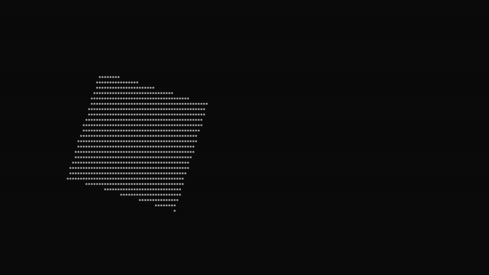

# Animated Shapes

A console C++ application that renders rotating geometric shapes with customizable parameters.

## Download

| Platform | Download Link |
|----------|---------------|
| Windows x64 | [geometric_shapes_x64.exe](https://github.com/ShulhaOleh/geometric_shapes/releases/download/v1.1/geometric_shapes_x64.exe) |
| Windows x86 | [geometric_shapes_x86.exe](https://github.com/ShulhaOleh/geometric_shapes/releases/download/v1.1/geometric_shapes_x86.exe) |

## System Requirements

- Windows 10 or higher
- Console/Terminal with ANSI escape sequence support

## Commands

| Command | Shorthand | Description | Example |
|---------|-----------|-------------|---------|
| `square [size]` | `s [size]` | Switch to square shape with optional size | `s 0.8` |
| `circle [radius]` | `c [radius]` | Switch to circle shape with optional radius | `c 0.6` |
| `rectangle [width] [height]` | `r [width] [height]` | Switch to rectangle with optional dimensions | `r 1.2 0.5` |
| `size [value]` | `sz [value]` | Update square size (only works for square) | `sz 0.9` |
| `radius [value]` | `rad [value]` | Update circle radius (only works for circle) | `rad 0.7` |
| `dim [width] [height]` | `d [width] [height]` | Update rectangle dimensions (only works for rectangle) | `d 1.5 0.6` |
| `speed [value]` | `sp [value]` | Change rotation speed (0.0 - 0.1) | `speed 0.01` |
| `char [symbol]` | `ch [symbol]` | Change drawing character | `char @` |
| `quit` | `q` | Exit application | `q` |

## Building from Source

### Prerequisites

- Visual Studio 2019 or higher
- Windows SDK

### Build Steps

1. Clone the repository:
```bash
   git clone https://github.com/YOUR_USERNAME/geometric_shapes.git
   cd geometric_shapes
```

2. Open `geometric_shapes.sln` in Visual Studio

3. Select build configuration:
   - For x64: `Release | x64`
   - For x86: `Release | x86`

4. Build the solution: `Ctrl+Shift+B`

5. Find executable in:
   - x64: `x64/Release/geometric_shapes.exe`
   - x86: `Release/geometric_shapes.exe`
